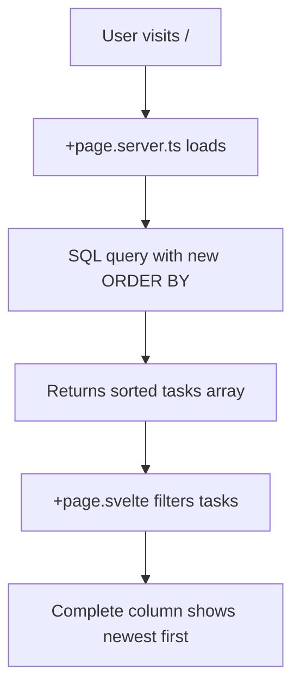

# Implementation Specification: Complete Column Sort Order Fix (CORRECTED)

**Task ID:** task-mmblnpx8  
**Version:** 2 (Corrected after v1 failure)  
**Date:** 2026-03-04  
**Stage:** Scout  

## CRITICAL CORRECTION FROM V1

**❌ PREVIOUS ERROR:** Builder modified `/src/routes/api/tasks/+server.ts` (API endpoint)  
**✅ CORRECT TARGET:** Must modify `/src/routes/+page.server.ts` (main dashboard data loader)  

**WHY THE CORRECTION IS NEEDED:**
- The main dashboard `/` loads data directly via `/src/routes/+page.server.ts`
- The API endpoint `/src/routes/api/tasks/+server.ts` is NOT used by the main dashboard
- Fixing the wrong file leaves the main dashboard's Complete column unchanged

## Problem Analysis

### Current Issue
- Main dashboard Complete column sorts by priority first, then updated_at
- Should sort by completed_at DESC to show newest completions on top
- **Root cause:** Wrong ORDER BY clause in `/src/routes/+page.server.ts` lines 7-11

### Current Implementation (WRONG FILE WAS TARGETED)
```typescript
// File: /src/routes/+page.server.ts (THIS is what needs to be fixed)
// Lines 7-11:
const tasks = db.prepare(`
    SELECT tasks.*, projects.name as project_name, projects.slug as project_slug, projects.stack_type as project_stack_type 
    FROM tasks 
    LEFT JOIN projects ON tasks.project_id = projects.id
    ORDER BY CASE priority WHEN 'urgent' THEN 0 WHEN 'high' THEN 1 WHEN 'medium' THEN 2 WHEN 'low' THEN 3 END, updated_at DESC
`).all() as Task[];
```

## EXACT IMPLEMENTATION REQUIRED

### File to Modify: `/src/routes/+page.server.ts`

**BEFORE (current code on line 7-11):**
```typescript
const tasks = db.prepare(`
    SELECT tasks.*, projects.name as project_name, projects.slug as project_slug, projects.stack_type as project_stack_type 
    FROM tasks 
    LEFT JOIN projects ON tasks.project_id = projects.id
    ORDER BY CASE priority WHEN 'urgent' THEN 0 WHEN 'high' THEN 1 WHEN 'medium' THEN 2 WHEN 'low' THEN 3 END, updated_at DESC
`).all() as Task[];
```

**AFTER (required change):**
```typescript
const tasks = db.prepare(`
    SELECT tasks.*, projects.name as project_name, projects.slug as project_slug, projects.stack_type as project_stack_type 
    FROM tasks 
    LEFT JOIN projects ON tasks.project_id = projects.id
    ORDER BY 
        CASE 
            WHEN status IN ('done', 'failed', 'paused') THEN 
                COALESCE(completed_at, updated_at)
            ELSE 
                (CASE priority WHEN 'urgent' THEN 0 WHEN 'high' THEN 1 WHEN 'medium' THEN 2 WHEN 'low' THEN 3 END) || '-' || updated_at
        END DESC
`).all() as Task[];
```

### Implementation Details

**Key Changes:**
1. **Conditional sorting**: Use different ORDER BY logic based on task status
2. **Completed tasks**: Sort by `completed_at DESC` (with `updated_at` fallback)  
3. **Non-completed tasks**: Maintain current priority + updated_at sorting
4. **Fallback handling**: `COALESCE(completed_at, updated_at)` handles missing completed_at

### Why This Approach

1. **Targeted fix**: Only affects completed tasks in Complete column
2. **Preserves existing behavior**: Other columns (Backlog, In Progress, Review) keep current sorting
3. **Handles edge cases**: Uses updated_at when completed_at is null
4. **Database-level**: More efficient than client-side sorting

## Data Flow Verification



**Critical Path:**
1. User visits main dashboard (`/`)
2. SvelteKit calls `+page.server.ts` load function
3. **NEW SQL** query sorts tasks with completed tasks by completed_at DESC
4. Frontend filters tasks into columns using existing logic
5. Complete column automatically shows newest completions first

## Files Modified

### Primary Target: `/src/routes/+page.server.ts`
- **Lines 7-11**: Replace ORDER BY clause with conditional sorting
- **No other changes needed in this file**

### Files NOT to Modify
- ❌ `/src/routes/api/tasks/+server.ts` (this was the wrong target in v1)
- ❌ `/src/routes/+page.svelte` (frontend filtering logic is correct)

## Testing Strategy

### Manual Verification Steps
1. **Check current dashboard**: Verify Complete column shows old sorting
2. **Apply the fix**: Modify only `/src/routes/+page.server.ts` 
3. **Refresh dashboard**: Verify Complete column now shows newest completions first
4. **Verify other columns**: Ensure Backlog, In Progress, Review maintain current sorting

### Test Cases
1. **Recently completed tasks**: Should appear at top of Complete column
2. **Mixed statuses**: Non-completed tasks should maintain priority sorting
3. **Missing completed_at**: Should fall back to updated_at for sorting
4. **Cross-column consistency**: Same task should sort appropriately in each column

## Success Criteria

✅ Complete column shows completed tasks with newest on top  
✅ Backlog/In Progress/Review columns maintain current priority-based sorting  
✅ Main dashboard loads data correctly from modified +page.server.ts  
✅ No changes needed to API endpoints or frontend filtering logic  
✅ Handles edge cases (missing completed_at values)  

## Builder Instructions

**CRITICAL:** Only modify `/src/routes/+page.server.ts`

1. **Open file**: `/src/routes/+page.server.ts`
2. **Find lines 7-11**: The db.prepare() SQL query  
3. **Replace ORDER BY clause**: Use the conditional sorting logic provided above
4. **Test**: Verify dashboard shows completed tasks newest-first in Complete column
5. **Do NOT modify**: Any API endpoints or frontend files

The fix is a single SQL query change in the main dashboard data loader.